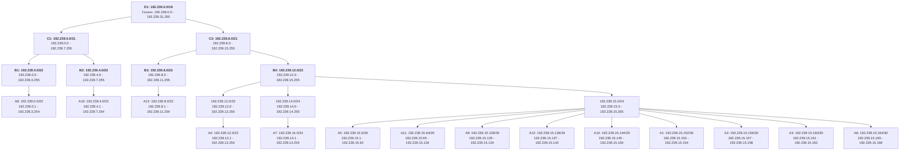

# Jarkom-Modul4-K56-2025

# Diagram Pohon Hierarki CIDR

Berikut adalah diagram pohon yang menunjukkan pembagian alamat IP dari jaringan global `192.239.0.0/19`.

```mermaid
graph TD
    %% ROOT
    D1["<b>D1: 192.239.0.0/19</b><br>Covers: 192.239.0.0 - 192.239.31.255"]

    %% LEVEL 1 – bagi dua 0–7 dan 8–15
    D1 --> C1["<b>C1: 192.239.0.0/21</b><br>192.239.0.0 - 192.239.7.255"]
    D1 --> C2["<b>C2: 192.239.8.0/21</b><br>192.239.8.0 - 192.239.15.255"]

    %% LEVEL 2 – di bawah C1
    C1 --> B1["<b>B1: 192.239.0.0/22</b><br>192.239.0.0 - 192.239.3.255"]
    C1 --> B2["<b>B2: 192.239.4.0/22</b><br>192.239.4.0 - 192.239.7.255"]

    B1 --> A8["A8: 192.239.0.0/22<br>192.239.0.1 - 192.239.3.254"]
    B2 --> A10["A10: 192.239.4.0/22<br>192.239.4.1 - 192.239.7.254"]

    %% LEVEL 2 – di bawah C2
    C2 --> B3["<b>B3: 192.239.8.0/22</b><br>192.239.8.0 - 192.239.11.255"]
    C2 --> B4["<b>B4: 192.239.12.0/22</b><br>192.239.12.0 - 192.239.15.255"]

    B3 --> A13["A13: 192.239.8.0/22<br>192.239.8.1 - 192.239.11.254"]

    %% Di bawah B4: pecah lagi
    B4 --> C4a["192.239.12.0/23<br>192.239.12.0 - 192.239.13.255"]
    B4 --> C4b["192.239.14.0/24<br>192.239.14.0 - 192.239.14.255"]
    B4 --> C4c["192.239.15.0/24<br>192.239.15.0 - 192.239.15.255"]

    C4a --> A4["A4: 192.239.12.0/23<br>192.239.12.1 - 192.239.13.254"]
    C4b --> A7["A7: 192.239.14.0/24<br>192.239.14.1 - 192.239.14.254"]

    %% Semua subnet 192.239.15.x di bawah 192.239.15.0/24
    C4c --> A5["A5: 192.239.15.0/26<br>192.239.15.1 - 192.239.15.62"]
    C4c --> A11["A11: 192.239.15.64/26<br>192.239.15.65 - 192.239.15.126"]
    C4c --> A9["A9: 192.239.15.128/29<br>192.239.15.129 - 192.239.15.134"]
    C4c --> A12["A12: 192.239.15.136/29<br>192.239.15.137 - 192.239.15.142"]
    C4c --> A14["A14: 192.239.15.144/29<br>192.239.15.145 - 192.239.15.150"]
    C4c --> A1["A1: 192.239.15.152/30<br>192.239.15.153 - 192.239.15.154"]
    C4c --> A2["A2: 192.239.15.156/30<br>192.239.15.157 - 192.239.15.158"]
    C4c --> A3["A3: 192.239.15.160/30<br>192.239.15.161 - 192.239.15.162"]
    C4c --> A6["A6: 192.239.15.164/30<br>192.239.15.165 - 192.239.15.166"]
```
